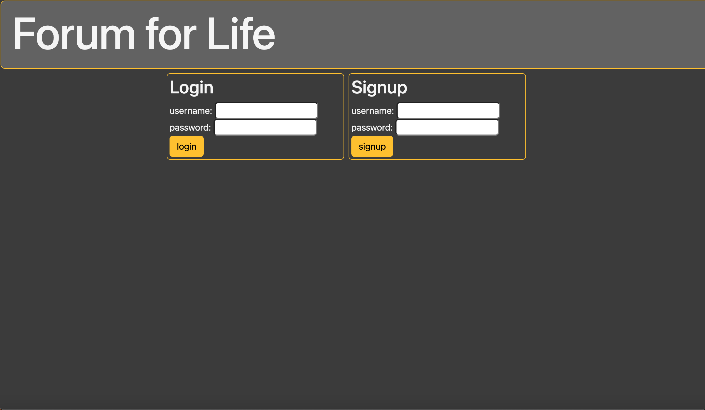
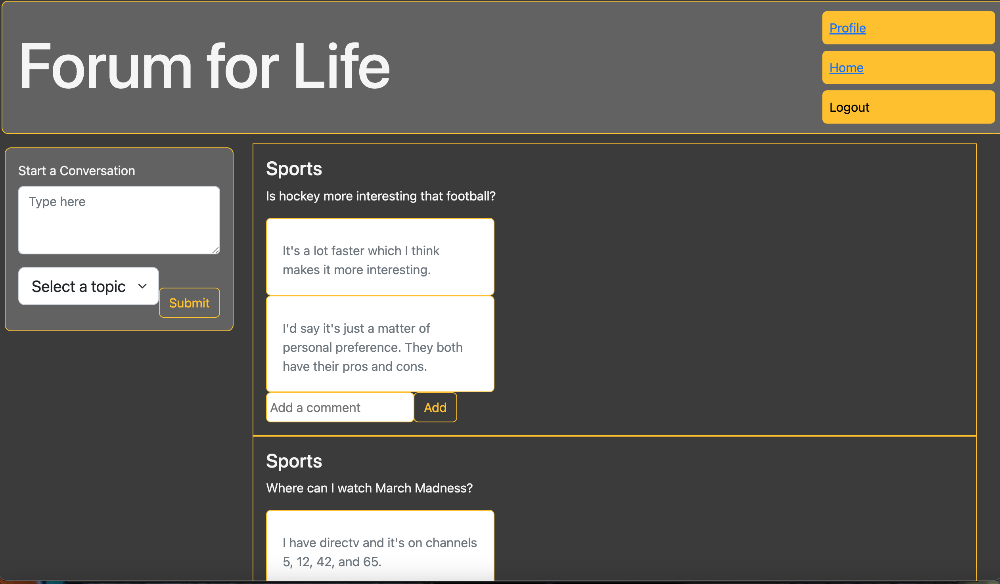
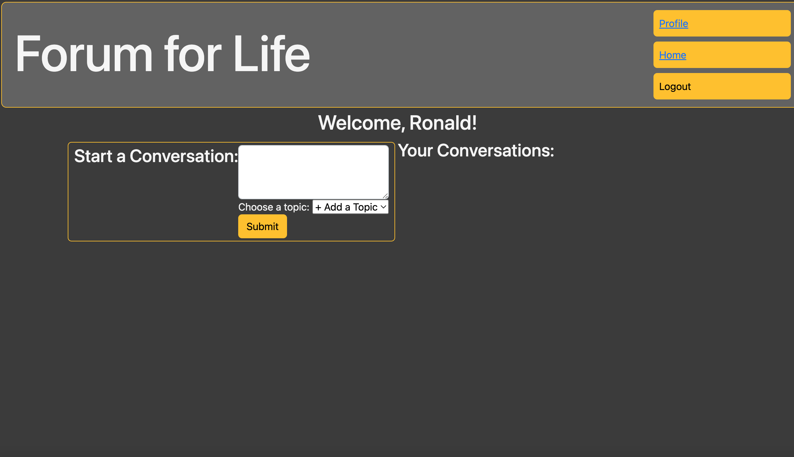

# Forum For Life

## Description 
Forum for life is a forum that allows an online user to create a profile and be able to discuss any topic with other fellow users. Our forum allows users, once signed in, to choose any topic their conversation will go under. Once the coversation is posted, other users along with the oiginal poster are able to comment on said converstion and give their input. There is also a profile page which allows the user to see all the converstions they have created!

This project was built using Express, Handlebars, and Sequelize. Bcrypt was used for password security. Front end was styled using CSS and Bootstrap.

## Deployed Link 
https://sleepy-temple-31862.herokuapp.com

## Preview 

## Contributions
 - Autumn Legere (https://github.com/autumnlegere)
 - Peter Holcomb (https://github.com/pholcomb91)
 - Ronald Martinez (https://github.com/RonaldMartinez00)

## Credits:
- .value for input  
    - [stackoverflow.com](https://stackoverflow.com/questions/48070987/how-to-get-user-input-from-javascript-form)

- model validations  
    - [sequelize.org](https://sequelize.org/docs/v6/)

- console log using handlebars  
    - [stackoverflow.com](https://stackoverflow.com/questions/17499742/how-do-i-add-console-log-javascript-logic-inside-of-a-handlebars-template)